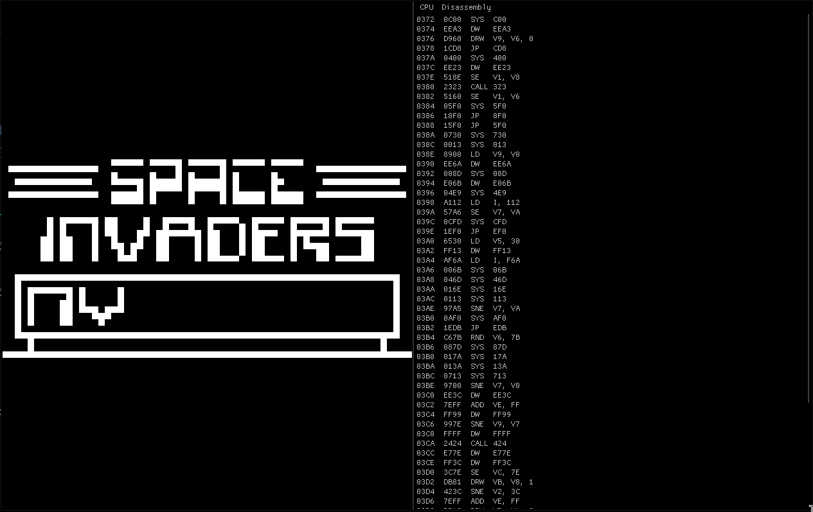

# chip8

a CHIP-8 emulator with an integrated disassembler and memory viewer



## build

Requires CMake 3.10+ and a C++23 compiler.

```
cmake -B build
cmake --build build
```

## usage

```
./build/chip8 <rom.ch8>
```

## controls

```
Keyboard        CHIP-8
1 2 3 4         1 2 3 C
Q W E R         4 5 6 D
A S D F         7 8 9 E
Z X C V         A 0 B F
```
